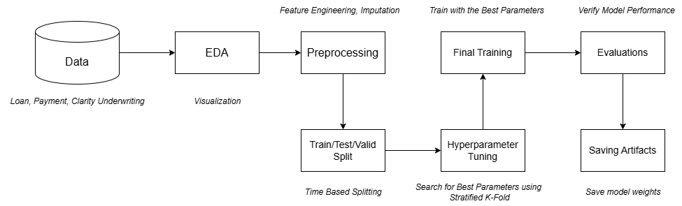

# Part 1 - Loan Risk Prediction Model

The loan risk prediction model workflow is presented as follows, executed in a single Jupyter notebook in the `notebook/mode.ipynb` file:



The following section provide a brief overview of each step in the workflow, details explanation can also be found in the Jupyter notebook.

## EDA

Before the EDA process is conducted, the three dataset `loan`, `payment` and `clarity_underwriting_variable` are joined together into a single dataset. Then, a target varaible is constructed based on the `loan_status` column with the following logic where bad/risky loan is defined as `1` and good loan is defined as `0`:

- For bad loan here are some of the examples:
    - External Collection, Internal Collection, Returned Item, Charged Off, Charged Off Paid Off, Settled Bankruptcy, Settlement Paid Off, Settlement Pending Paid Off

- For good loan here are some of the examples:
    - Paid Off Loan, Pending Paid Off

- Excluded cases
    - Withdrawn Application, Rejected, Voided, Pending Rescind, Pending Application Fee and so on
    - Why?
        - To avoid confusing the model and causes data leakage

Several visualizations like histogram are plotted to see some variables distribution, bivariate plot by plotting some features against the target variable are also performed. Furthermore, a correlation matrix is plotted to see the correlation between the features and the target variable.

## Preprocessing

In the preprocessing the following steps are performed: imputations, feature engineering and removal of redundant features like `id`.

The removal of `id` column is performed as it does not contribute to the model, merely act as an identifier. For feature engineering, it is done of the `applicationData` and `originatedDate` feature by extracting useful information such as year, month, and day and also finding their difference which suggest how long the underwriting process took.

For imputation, 2 approaches are used and justified below:

- Numerical features
    - Impute with the median value due to the skewness nature of financial data, we can also see from the plot we did in EDA
    - After filling the missing values, a binary column is then created identify the missing cells
- Categorical features
    - A special category called `missing` is created to identify the missing cells

## Train/Test/Valid Split

For data splitting strategy for model training, we adopt a time-based splitting due to the following concerns:

- Economic shift
- People behaviour change over time
- Different marketing strategy over time

With this strategy we avoid leaking future information into the model. The data is split with ratio 70, 15, 15 for train, test and valid respectively, a common adopted ratio for machine learning.

## Hyperparameter Tuning

Before training the model, we will conduct hyperparameter tuning to seek for the best hyperparameter. This is done through Stratified K-Fold Cross Validation with 5 folds (maintaining the class balance in each fold). The training is done through `optuna` and `mlfow` for version control and tracking. 

The strategy adopted is to maximize the AUC for a better discrimination power of the model.

## Model Training

With the best hyperparameter found, we proceed to train the model. The model is trained and evaluated on both the validation set again and the hidden test set.

Then, the model is further evaluated using AUC-ROC curve, precision-recall curve and probability distribution based on the threshold.

## Threshold Analysis

To further optimize the recall and precision of the model, we found that there is a huge overalapping region of the two class when the threshold is set to 0.5. Thus 2 strategies are investigated:

- A: maximize the F1 score
- B: make sure the recall is at least 0.7

The two strategies are evaluated by adjusting the threshold

```txt
=== STRATEGY COMPARISON ON TEST SET ===
...
F1-Score        0.590        0.595        Strategy B
Precision       0.467        0.493        Strategy B
Recall          0.801        0.750        Strategy A
AUC-ROC         0.750        0.750        Tie  
```

However, due to the costliness of missing a risky loan in a lower Recall, strategy A should be prioritized. Consider, the following scenario, let the average loan amount be $5000 with 80% loss rate on default. The review cost of a loan is $50 and the review is conducted on all the risky loans:

```
=== BUSINESS IMPACT ANALYSIS ===
Assumptions:
- Average loan amount: $5,000
- Loss rate on defaulted loans: 80%
- Test set size: 100,760 loans
- Actual risky loans: 37,089
- Actual good loans: 63,671
```

| Metric | Strategy A (F1 Max) | Strategy B (70% Recall) |
|--------|---------------------|-------------------------|
| Risky loans caught | 29,694 / 37,089 (80.1%) | 27,810 / 37,089 (75.0%) |
| Good loans flagged incorrectly | 33,895 | 28,565 |
| Prevented losses | $118,776,000 | $111,240,000 |
| Actual losses | $29,580,000 | $37,116,000 |
| Review costs | $3,179,450 | $2,818,750 |
| Net benefit | $86,016,550 | $71,305,250 |
| ROI | 70.5% | 62.5% |

In conclusion, due to the costliness of missing a risky loan, we should aim for a higher recall in the model as it brings more ROI to the business.