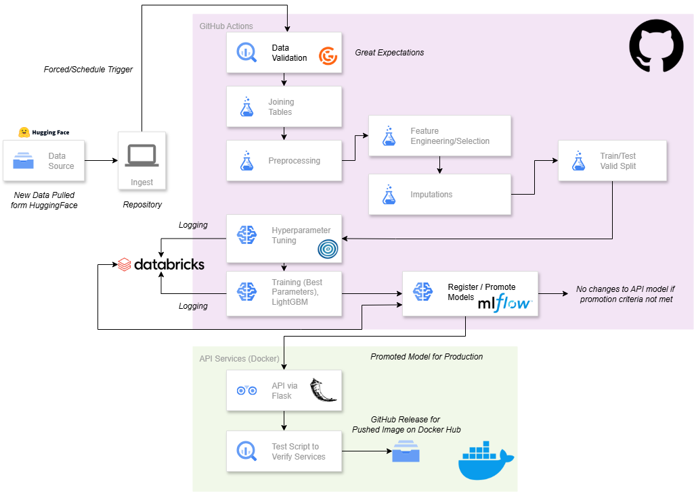

# Part 2 - Automated ML System

The diagram below presents the proposed architecture for an automated machine learning system utilizing Python, GitHub, GitHub Actions, DataBricks, Hugging Face and Docker.

{width=80%}

**Source Code**

- GitHub: https://github.com/keanteng/jidoubunseki
- Docker Hub: https://hub.docker.com/r/keantengblog/loan-risk-api

## Architecture Overview

The architecture make use of Python, Hugging Face, GitHub Actions, Github repository, DataBricks as well as Docker to automate the machine learning workflow.

The workflow can be either triggered periodically, manually (through GitHub Action or pushing changes to the repository such as changing the data). Currently the pipeline will be triggered once every 2 day at 2AM UTC or manually triggering the workflow through GitHub Actions.

Once the workflow is triggered it will first extract the data stored in Hugging Face, and then it will perform data validation using Great Expectation to ensure the integrity of the data. Three files are expected to be present, the `loan`, `payment` and the `clarity_underwriting_variable`. Then the dataset will be joined according to the identifiers.

For the current implementation, Great Expectation only check for the presence of the identifier columns. Further check can be added for a more robust validation.

Then, the data will be preprocessed using prewritten python scripts to perform tasks such as imputations, feature engineering and removal of unnecessary features such as identifiers. 

Then, the processed data will be splitted into training, testing and validation dataset in 70, 15 and 15 ratio respectively. The splitting is done using time based strategy to ensure that the model is trained on past data and tested on future data, avoiding data leakage. 

The modeling starts with hyperparameter tuning using Optuna, monitored by MLFlow this ensure that each trigger of the workflow will retain the best model and hyperparameters and the relevant metrics. In each trigger, the best parameters will be passed to train a final model. The artifacts from the hyperparameter tuning process and training process will be stored in DataBricks with there support of MLFlow server for logging and tracking.

Then, a promotion criteria will be performed to determine whether the model should be promoted to production. The promotion system will check the performance of the model against certain criteria like minimum recall and precision or other metrics such as 2% better than the previous model in terms of F1 score. In our case, we just make sure the precision and recall is above 0.72 as part of demonstration.

Then the promoted model will be deployed using Flask, containerized on Docker so that it can be accessed through API for single or batch prediction. To make sure the model works after deployed, a test script will also be triggered to ensure the model can be accessed and the API is working as expected.

Then the Docker image will be pushed to the Docker Hub repository where we can deploy the services by pulling the images. A release will also be created in GitHub repository about the Docker Image.

## Using & Testing The System (Code)

> This part can be found in the README file in this repository.

## Limitations

The data ingestion process in the current setup is storing the data in Hugging Face, which is not ideal for a more robust pipeline, storage such as AWS S3 or Google Cloud Storage can be considered for more security and scalability.

The current implementation of the data validation using Great Expectation is only checking for the presence of identifier columns. More robust validation can be added to ensure data quality, such as checking for null values, data types, and value ranges.

More robust logging and monitoring can be added so that error can be captured and alerted. Currently, the logging is done using print statements and MLFlow, but a more robust logging system such as Prometheus can be implemented.

## Extra Visualization

{width=50%}
{width=50%}

{width=50%}
{width=50%}